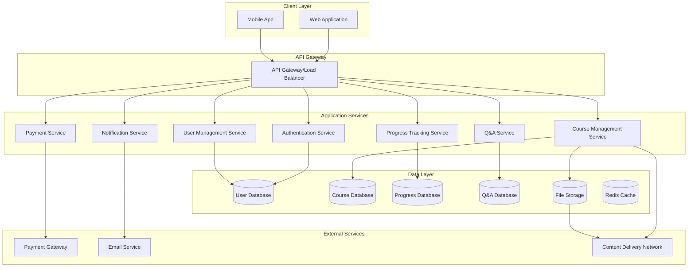
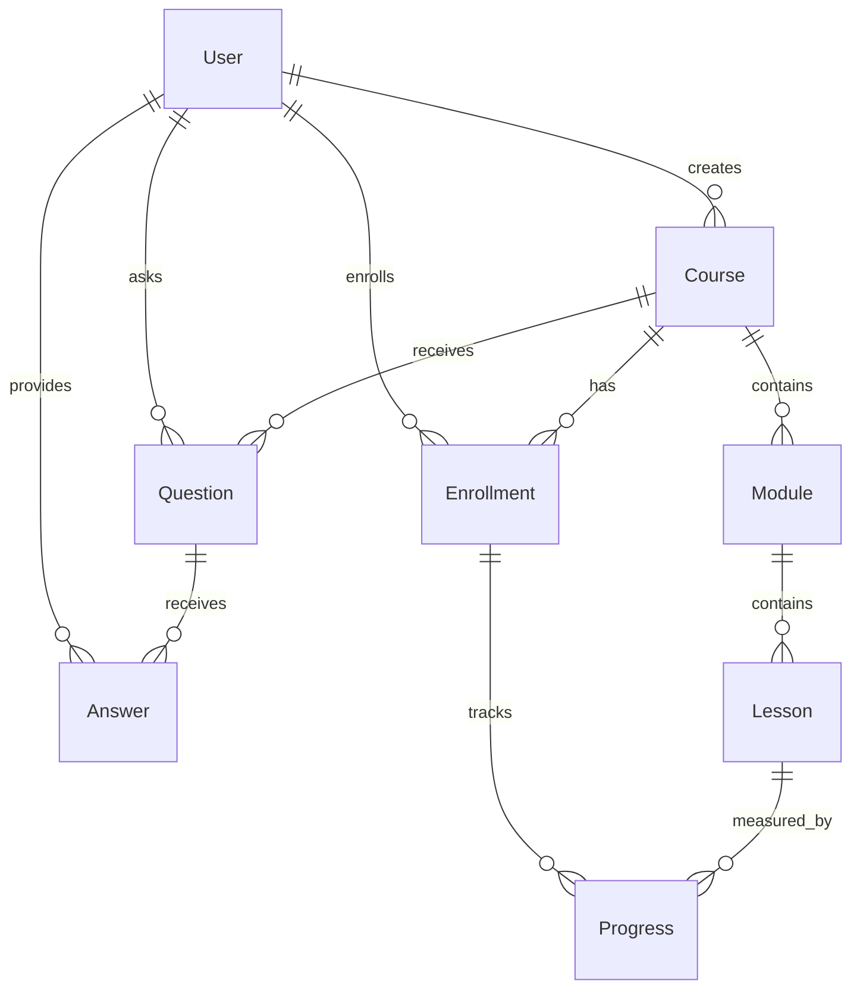

# Design Document - Online Learning System

## Overview

The online learning system is designed as a modern web-based platform following a microservices architecture pattern. The system supports multiple user roles (students, instructors, administrators) and provides comprehensive course management, learning tracking, and interactive features. The architecture emphasizes scalability, security, and user experience.

## Architecture

### High-Level Architecture



### Technology Stack

- **Frontend**: Next.js with TypeScript, Redux Toolkit for state management
- **Backend**: Flask (Python) with Flask-RESTful for API development
- **Database**: MySQL for relational data storage
- **ORM**: SQLAlchemy for database operations
- **Caching**: Redis for session management and performance optimization
- **File Storage**: AWS S3 or similar cloud storage for media files
- **Authentication**: JWT tokens with Flask-JWT-Extended
- **Payment**: Integration with Stripe/PayPal APIs
- **Real-time**: WebSocket connections using Flask-SocketIO for live Q&A and notifications

## Components and Interfaces

### Core Components

#### 1. User Management Component
- **Purpose**: Handle user authentication, authorization, and profile management
- **Key Classes**: User, UserProfile, Role, Permission
- **Interfaces**: 
  - `IUserService`: User CRUD operations
  - `IAuthService`: Authentication and authorization
  - `IProfileService`: Profile management

#### 2. Course Management Component
- **Purpose**: Handle course creation, content management, and catalog operations
- **Key Classes**: Course, Module, Lesson, Content, Category
- **Interfaces**:
  - `ICourseService`: Course CRUD and search operations
  - `IContentService`: Content upload and management
  - `ICatalogService`: Course discovery and filtering

#### 3. Enrollment and Payment Component
- **Purpose**: Handle course enrollment, payment processing, and access control
- **Key Classes**: Enrollment, Payment, Transaction, Discount
- **Interfaces**:
  - `IEnrollmentService`: Enrollment management
  - `IPaymentService`: Payment processing
  - `IAccessControlService`: Course access validation

#### 4. Progress Tracking Component
- **Purpose**: Track student progress, achievements, and completion status
- **Key Classes**: Progress, Achievement, Certificate, Milestone
- **Interfaces**:
  - `IProgressService`: Progress tracking and updates
  - `IAchievementService`: Achievement and certificate management
  - `IAnalyticsService`: Learning analytics

#### 5. Q&A Management Component
- **Purpose**: Handle course discussions, questions, and answers
- **Key Classes**: Question, Answer, Discussion, Vote
- **Interfaces**:
  - `IQAService`: Q&A CRUD operations
  - `IModerationService`: Content moderation
  - `INotificationService`: Real-time notifications

### API Design

#### Flask RESTful Endpoints Structure

```
/api/v1/
├── auth/
│   ├── POST /login
│   ├── POST /register
│   ├── POST /refresh
│   └── POST /logout
├── users/
│   ├── GET /profile
│   ├── PUT /profile
│   └── GET /dashboard
├── courses/
│   ├── GET / (search & filter)
│   ├── GET /<int:id>
│   ├── POST / (create)
│   ├── PUT /<int:id>
│   └── DELETE /<int:id>
├── enrollments/
│   ├── POST /
│   ├── GET /my-courses
│   └── DELETE /<int:id>
├── payments/
│   ├── POST /process
│   ├── GET /history
│   └── POST /webhook
├── progress/
│   ├── GET /course/<int:course_id>
│   ├── POST /lesson/<int:lesson_id>/complete
│   └── GET /certificates
└── qa/
    ├── GET /course/<int:course_id>
    ├── POST /questions
    ├── POST /answers
    └── PUT /vote
```

## Data Models

### Core Entities

#### User Entity (SQLAlchemy Model)
```python
from sqlalchemy import Column, Integer, String, Boolean, DateTime, Enum
from sqlalchemy.ext.declarative import declarative_base
from datetime import datetime
import enum

Base = declarative_base()

class UserRole(enum.Enum):
    STUDENT = 'student'
    INSTRUCTOR = 'instructor'
    ADMIN = 'admin'

class User(Base):
    __tablename__ = 'users'
    
    id = Column(Integer, primary_key=True)
    email = Column(String(255), unique=True, nullable=False)
    password_hash = Column(String(255), nullable=False)
    first_name = Column(String(100), nullable=False)
    last_name = Column(String(100), nullable=False)
    role = Column(Enum(UserRole), nullable=False, default=UserRole.STUDENT)
    profile_image = Column(String(500), nullable=True)
    created_at = Column(DateTime, default=datetime.utcnow)
    updated_at = Column(DateTime, default=datetime.utcnow, onupdate=datetime.utcnow)
    is_active = Column(Boolean, default=True)
```

#### Course Entity (SQLAlchemy Model)
```python
from sqlalchemy import Column, Integer, String, Text, Float, Boolean, DateTime, Enum, ForeignKey, JSON
from sqlalchemy.orm import relationship
import enum

class DifficultyLevel(enum.Enum):
    BEGINNER = 'beginner'
    INTERMEDIATE = 'intermediate'
    ADVANCED = 'advanced'

class Course(Base):
    __tablename__ = 'courses'
    
    id = Column(Integer, primary_key=True)
    title = Column(String(255), nullable=False)
    description = Column(Text, nullable=False)
    instructor_id = Column(Integer, ForeignKey('users.id'), nullable=False)
    category_id = Column(Integer, ForeignKey('categories.id'), nullable=False)
    price = Column(Float, nullable=False, default=0.0)
    currency = Column(String(3), nullable=False, default='USD')
    difficulty = Column(Enum(DifficultyLevel), nullable=False)
    duration = Column(Integer, nullable=False)  # in hours
    language = Column(String(50), nullable=False, default='en')
    thumbnail_url = Column(String(500), nullable=True)
    preview_video_url = Column(String(500), nullable=True)
    prerequisites = Column(JSON, nullable=True)  # JSON array of strings
    learning_outcomes = Column(JSON, nullable=True)  # JSON array of strings
    is_published = Column(Boolean, default=False)
    created_at = Column(DateTime, default=datetime.utcnow)
    updated_at = Column(DateTime, default=datetime.utcnow, onupdate=datetime.utcnow)
    
    # Relationships
    instructor = relationship("User", backref="courses")
    category = relationship("Category", backref="courses")
```

#### Module and Lesson Entities
```typescript
interface Module {
  id: string;
  courseId: string;
  title: string;
  description: string;
  order: number;
  lessons: Lesson[];
}

interface Lesson {
  id: string;
  moduleId: string;
  title: string;
  content: LessonContent[];
  duration: number; // in minutes
  order: number;
  isPreview: boolean;
}

interface LessonContent {
  id: string;
  type: ContentType;
  title: string;
  url?: string;
  text?: string;
  order: number;
}

enum ContentType {
  VIDEO = 'video',
  TEXT = 'text',
  DOCUMENT = 'document',
  QUIZ = 'quiz',
  ASSIGNMENT = 'assignment'
}
```

#### Enrollment and Progress Entities
```typescript
interface Enrollment {
  id: string;
  userId: string;
  courseId: string;
  enrolledAt: Date;
  completedAt?: Date;
  progress: number; // percentage
  lastAccessedAt: Date;
}

interface Progress {
  id: string;
  enrollmentId: string;
  lessonId: string;
  isCompleted: boolean;
  completedAt?: Date;
  timeSpent: number; // in minutes
  score?: number;
}
```

#### Q&A Entities
```typescript
interface Question {
  id: string;
  courseId: string;
  userId: string;
  lessonId?: string;
  title: string;
  content: string;
  isAnswered: boolean;
  createdAt: Date;
  updatedAt: Date;
  votes: number;
}

interface Answer {
  id: string;
  questionId: string;
  userId: string;
  content: string;
  isInstructorAnswer: boolean;
  isAccepted: boolean;
  createdAt: Date;
  votes: number;
}
```

### Database Relationships



## Error Handling

### Error Response Format
```typescript
interface ErrorResponse {
  success: false;
  error: {
    code: string;
    message: string;
    details?: any;
    timestamp: string;
  };
}
```

### Error Categories
1. **Authentication Errors** (401): Invalid credentials, expired tokens
2. **Authorization Errors** (403): Insufficient permissions
3. **Validation Errors** (400): Invalid input data
4. **Not Found Errors** (404): Resource not found
5. **Payment Errors** (402): Payment processing failures
6. **Server Errors** (500): Internal system errors

### Error Handling Strategy
- Global error middleware for consistent error responses
- Logging all errors with appropriate severity levels
- User-friendly error messages for client-side display
- Retry mechanisms for transient failures
- Circuit breaker pattern for external service calls

## Testing Strategy

### Testing Pyramid

#### Unit Tests (70%)
- Test individual functions and methods
- Mock external dependencies
- Focus on business logic validation
- Target: >90% code coverage

#### Integration Tests (20%)
- Test API endpoints with real database
- Test service interactions
- Validate data flow between components
- Use test database with seed data

#### End-to-End Tests (10%)
- Test complete user workflows
- Automated browser testing with Cypress/Playwright
- Test critical user journeys:
  - Course discovery and enrollment
  - Content consumption and progress tracking
  - Payment processing
  - Q&A interactions

### Testing Tools and Frameworks
- **Unit Testing**: pytest for Python backend testing
- **API Testing**: pytest with Flask test client
- **Database Testing**: pytest-mysql for MySQL test database
- **Frontend Testing**: Jest and React Testing Library for Next.js components
- **E2E Testing**: Cypress for browser automation
- **Performance Testing**: Locust for load testing Python applications
- **Security Testing**: OWASP ZAP for vulnerability scanning

### Continuous Integration
- Automated test execution on every commit
- Code quality gates with SonarQube
- Security scanning in CI pipeline
- Performance regression testing
- Automated deployment to staging environment

## Security Considerations

### Authentication and Authorization
- JWT tokens with Flask-JWT-Extended and short expiration times
- Refresh token rotation mechanism
- Role-based access control (RBAC) with Flask-Principal
- Multi-factor authentication for instructors
- Password strength requirements and hashing with Werkzeug security

### Data Protection
- HTTPS encryption for all communications
- Database encryption at rest
- PII data anonymization in logs
- GDPR compliance for user data handling
- Regular security audits and penetration testing

### Content Security
- File upload validation and virus scanning
- Content moderation for user-generated content
- Rate limiting to prevent abuse
- CORS configuration for API access
- Input validation and sanitization

This design provides a solid foundation for implementing the online learning system while ensuring scalability, security, and maintainability.